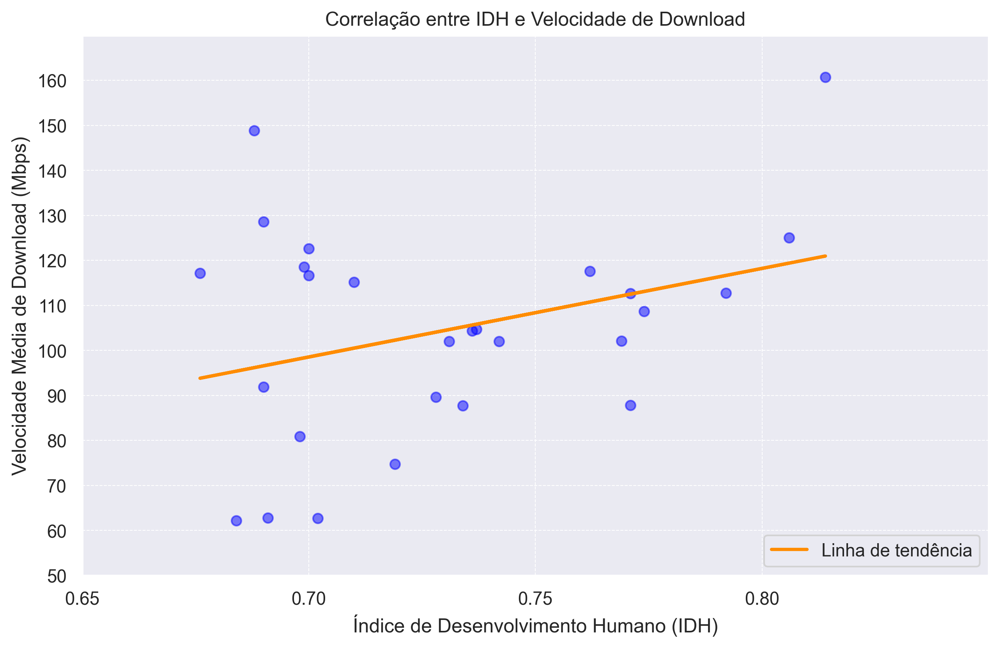
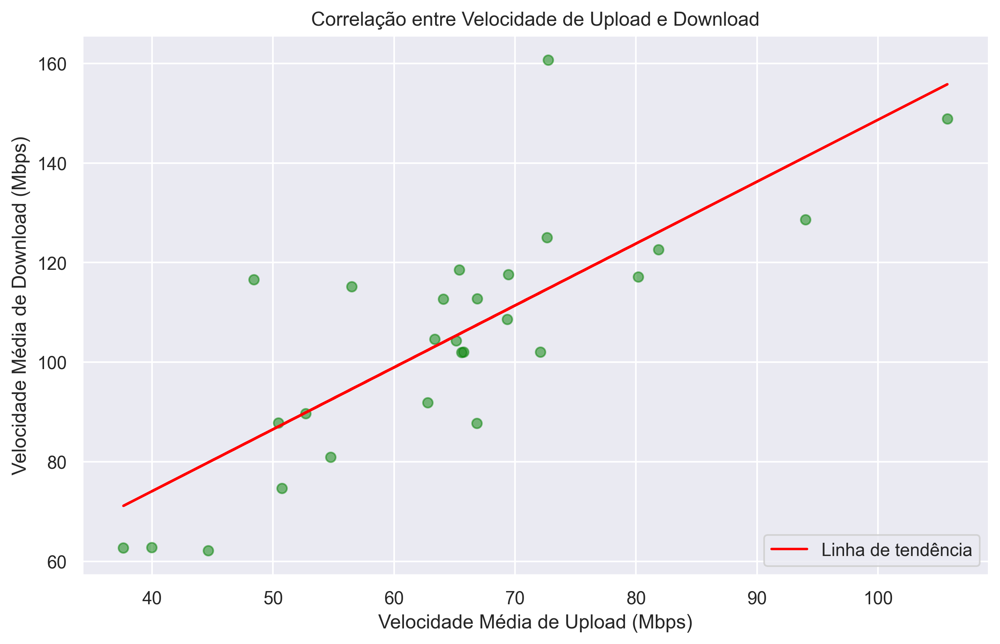

# Análise das Distribuições de Velocidades de Download de Internet no Brasil

Neste repositório, apresentamos uma análise das distribuições de velocidades de download de internet no Brasil com base nos testes realizados pela Speedtest durante o ano de 2021. O objetivo é comparar as velocidades de download de internet com o Índice de Desenvolvimento Humano (IDH) no mesmo período.

## Sobre o Speedtest
Speedtest é uma ferramenta popular desenvolvida pela Ookla para medir a velocidade de conexão de internet. Através de sua plataforma, usuários ao redor do mundo podem testar a velocidade de download e upload de suas conexões, bem como a latência. Esses dados são então compilados para fornecer uma visão abrangente do desempenho da internet em diferentes regiões.

## Sobre o IBGE
O Instituto Brasileiro de Geografia e Estatística (IBGE) é a principal agência de estatísticas do Brasil. O IBGE é responsável pela coleta, análise e disseminação de dados demográficos, sociais e econômicos. Entre suas diversas atribuições, o IBGE calcula o Índice de Desenvolvimento Humano (IDH) dos estados brasileiros.

## Objetivo da Análise
O objetivo desta análise é investigar o impacto da distribuição do IDH nos diferentes estados brasileiros sobre a velocidade de internet. Ao correlacionar os dados de velocidade de download fornecidos pelo Speedtest com o IDH de cada estado, buscamos entender como fatores socioeconômicos influenciam a qualidade da conexão de internet no Brasil.

### Imagens demonstração

Aqui está como exemplo algumas imagens relacionadas à análise:

*Figura 1: Correlação entre o Índice de Desenvolvimento Humano (IDH) e as velocidades de download de internet nos estados brasileiros em 2021*

*Figura 2: Correlação entre as velocidades de download e upload da internet no Brasil em 2021*

## Licença
Este projeto está licenciado sob a [Licença MIT](LICENSE).

---

**Nota**: Para mais informações sobre o dataset com os relatórios da Speedtest utilizados, visite repositório [ookla-open-data](https://github.com/teamookla/ookla-open-data).
Para mais detalhes sobre o IBGE e o cálculo do IDH, visite o [Atlas](http://www.atlasbrasil.org.br/).