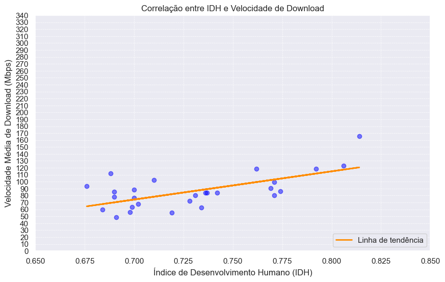
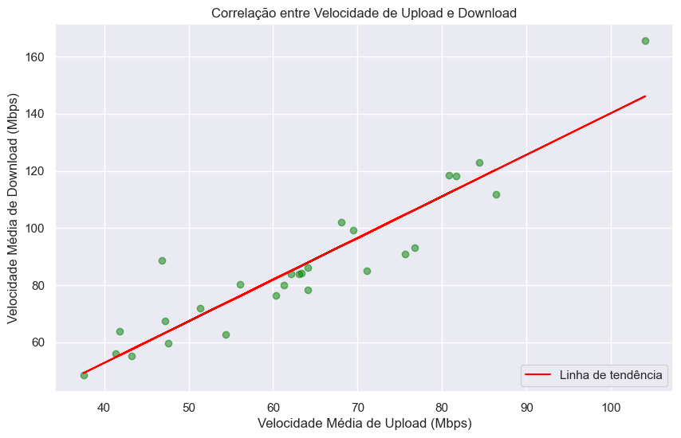

# Análise das Distribuições de Velocidades de Download de Internet no Brasil

Neste repositório, apresentamos uma análise das distribuições de velocidades de download de internet no Brasil com base nos testes realizados pela Speedtest em outubro de 2022. O objetivo é comparar as velocidades de download e upload de internet com o Índice de Desenvolvimento Humano (IDH), tanto em nível municipal quanto estadual.

## Fontes de dados

### Speedtest
Speedtest é uma ferramenta popular desenvolvida pela Ookla para medir a velocidade de conexão de internet. Através de sua plataforma, usuários ao redor do mundo podem testar a velocidade de download e upload de suas conexões, bem como a latência. Esses dados são então compilados para fornecer uma visão abrangente do desempenho da internet em diferentes regiões.

### Sobre o IBGE
O Instituto Brasileiro de Geografia e Estatística (IBGE) é a principal agência de estatísticas do Brasil. O IBGE é responsável pela coleta, análise e disseminação de dados demográficos, sociais e econômicos. Entre suas diversas atribuições, o IBGE disponibiliza shapefiles com as malhas territoriais dos municípios brasileiros, utilizados nesta análise para o join espacial dos dados.

### Sobre o Atlas Brasil / IDH
Os dados de IDH utilizados nesta análise são provenientes do Atlas Brasil (`Atlas - IDH Brasileiro.xlsx`), que disponibiliza o IDHM e seus sub-índices (Renda, Educação e Longevidade) por estado.

## Objetivo da Análise
O objetivo desta análise é investigar como o IDH dos diferentes municípios e estados brasileiros se relaciona com a velocidade de internet. Ao correlacionar os dados de velocidade de download e upload fornecidos pelo Speedtest com o IDHM de cada território, buscamos entender como fatores socioeconômicos influenciam a qualidade da conexão de internet no Brasil.

### Imagens de Demonstração

Aqui estão algumas imagens relacionadas à análise:

*Figura 1: Correlação entre o Índice de Desenvolvimento Humano (IDH) e as velocidades de download de internet nos estados brasileiros em 2022*

*Figura 2: Correlação entre as velocidades de download e upload da internet no Brasil em 2022*

---

**Nota**: Para mais informações sobre o dataset com os relatórios da Speedtest utilizados, visite o repositório [ookla-open-data](https://github.com/teamookla/ookla-open-data).
Para mais detalhes sobre o IBGE e os shapefiles de municípios, visite [IBGE Malhas Territoriais](https://www.ibge.gov.br/geociencias/organizacao-do-territorio/malhas-territoriais/15774-malhas.html).
Para mais informações sobre o IDH municipal e estadual, visite o [Atlas Brasil](http://www.atlasbrasil.org.br/).